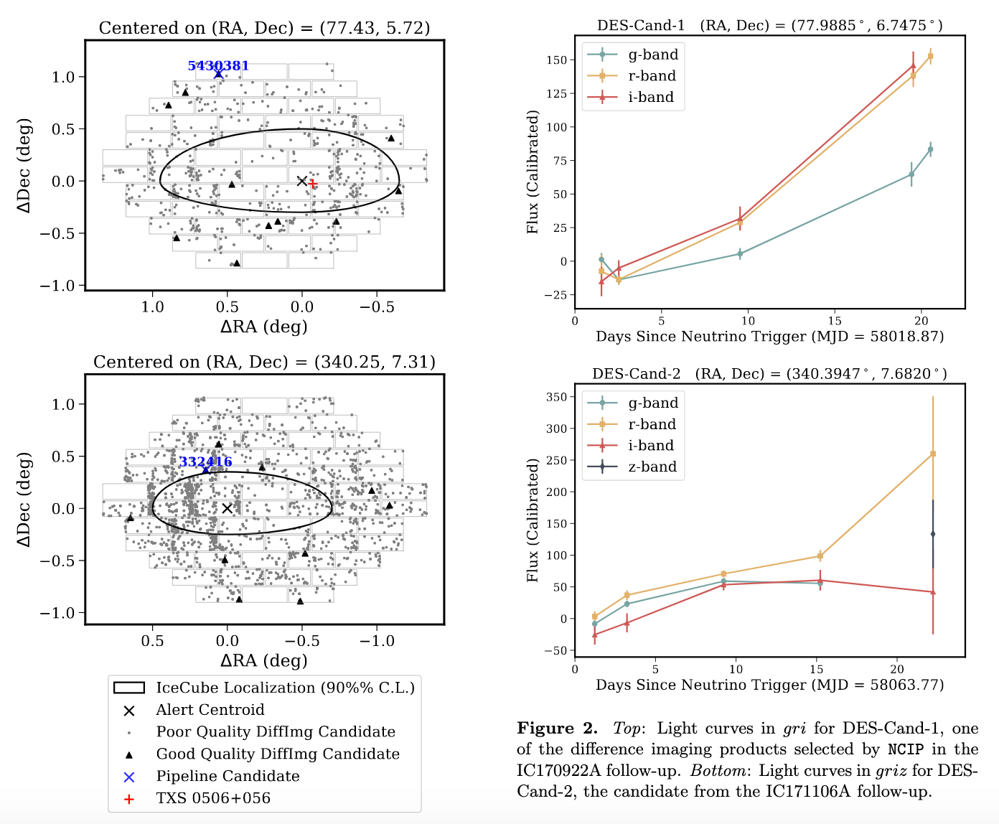
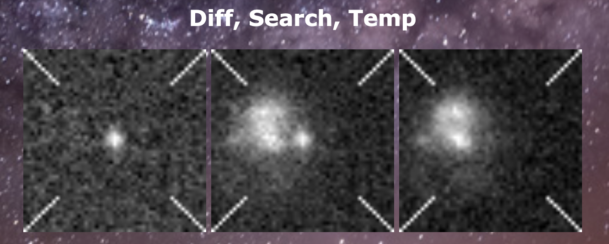
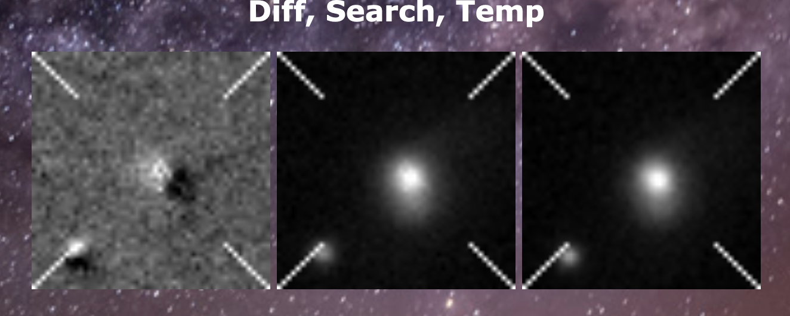

# Bechtol Group Multimessenger Astrophysics

In the Bechtol Group, we perform realtime searches for counterparts to rare and exciting astrophysical physical events. With our collaborators in the [Dark Energy Survey](https://www.darkenergysurvey.org/), we have targeted extemely high energy neutrinos detected by IceCube and binary neutron star and neutron star black hole mergers detected by LIGO and Virgo.

## IceCube Follow-up

For a great summary of this project, check out a [Darchive article](https://www.darkenergysurvey.org/darchive/searching-for-explosive-optical-counterparts-to-icecube-neutrinos/) written by Jacqueline Beran.

The goal of this project was to target the regions of sky corresponding to the direction from which IceCube detected an extremeley high energy neutrino in search of an optical counterpart. Theoretically, a core-collapse supernova could have an internal jet which forms during the collapse, and if that jet is pointed at the Earth, it would accelerate hadrons toward us, which could then interact to produce the high energy neutrinos detected by IceCube. The explosion would likely not produce a gamma ray signal, so searching for this object using an optical telescope is the best option.

We performed the searches using the Dark Energy Camera (DECam) and Victor M. Blanco telescope, which are located at Cerro Tololo Inter-American Observatory in Chile.

Here is what we saw in the follow-ups of IC170922A (top) and IC171106A (bottom):

Each dot on in the left side figures represents something that was observed to have a changing brightness during the observations. A significant portion of this work was developing a methodology for finding the single potential counterpart in the sample of thousands of varying objects.

That methodology and accompanying sensitivity analysis are published in the [Astrophysical Journal](https://iopscience.iop.org/article/10.3847/1538-4357/ab3a45) and available on the [arXiv](https://arxiv.org/abs/1907.07193).

## LIGO and Virgo Gravitational Wave Follow-up

A second project where we utilize the same instruments and methodologies is in the follow-up of graviational waves from binary neutron star and neutron star black hole mergers.

When LIGO or Virgo (or both) detect gravitataional waves, like IceCube they are able to calculate the most likely part of the sky to contain the counterpart. And in similar fashion, we target this region of sky with DECam:

The challenge here is identical to the IceCube follow-up project: find the most interesting counterparts as quickly as possible. 

## Difference Imaging

An optical counterpart to a multimessenger alert will likely have just exploded or merged to produce the neutrino or graviational wave. This means that its luminosity will be evolving, and it could also be a new light source that was not there previously. To detect this changing brightness, we use a process called difference imaging.

In differenece imaging, we compare images from our realtime observations to images of the same parts of the sky from previous observations (usually from several months to a few years ago). The jargon to be aware of here is the "Search" image is the new image from the realtime observations, the "Template" image is the archival image from years ago, and the "Difference" image is the pixel-by-pixel subtraction of the two images. These images look like this:

So we can use this process to find the objects in the night sky whose brightnesses have changed since their last observation. And this process is what produced all the dots shown on the IceCube field of view figures.

### A problem with difference imaging:

This process typically will find ~1,000 things with varying brightness in each DECam image. However, based on observered rates of supernovae, active galactic nuclei, and other known variable-brightness sources, only about 20 objects should be detected. That is a HUGE difference, so what causes it?

Some of the things detected by difference imaging are moving objects (asteroids, satellites, etc.), so they are present in one image and not in the other as a result of their changing position. These false detections are easy to rule out though, since we can just require that we detect the object on more than one night in our realtime observations to make sure it isn't moving.

There is another contaminant that is much harder to remove algorithmically: **difference imaging artifacts**.

Sometimes, instead of looking nice like the previous image set, difference images can look like this:

In this example, neither of the two objects in the images have varying brightness. However, there was a slight misalignment between the search image and the template image, so when the pixel-by-pixel subtraction was performed, and an erroneous result was produced. 

You can notice this by eye via the dark spots right next to the objects in the difference image, and this feature in a difference image is referred to as a "bad subtraction."

Typically over 90% of the things we detect in realtime follow-ups are artifacts like this, and there is a great need to find a way to remove these artifacts so that we can more quickly find the real counterpart. The "by-eye" detection method is currently the standard, but definitely needs to be improved upon.

## A Potential Project

What we would like to have is a piece of software that can detect difference-imaging artifacts in images. In our group we've started developing expertise in convolutional neural networks (CNNs), which utilize machine learning algorithms to detect patterns in images. A well-designed CNN will have very little trouble detecting the dark spot pattern of image artifacts. 

A robust artifact detector using a CNN would expedite realtime follow-ups, result in a publication, be incorporated into the DESGW image processing pipeline, useable by any researcher working with difference images, and a huge benefit to the next era of optical astronomy (i.e., lots of citations).

The steps to do this project are:

- Learn the basics of machine learning
- Build a trial CNN on the MNIST dataset
- Develop code to assess the performance of the trial CNN
- Make the trial CNN robust to changes in images
- Collect a large dataset of DECam difference images
- Tweak the CNN to work well on this dataset
- Evaluate the CNN's performance
- Write a paper
- Integrate a pre-trained version of the CNN into the DESGW pipeline