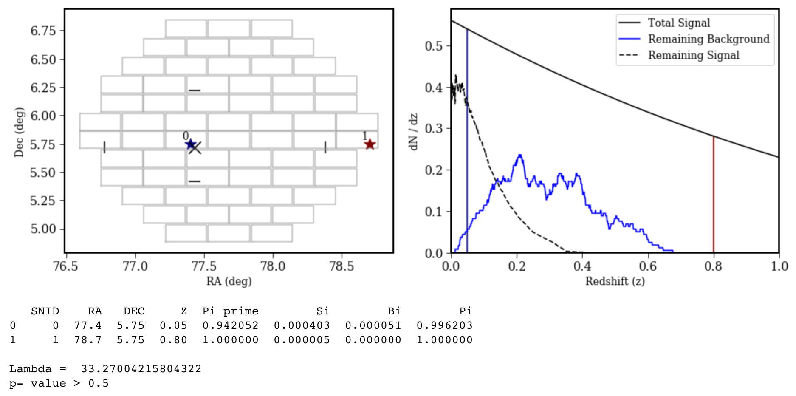
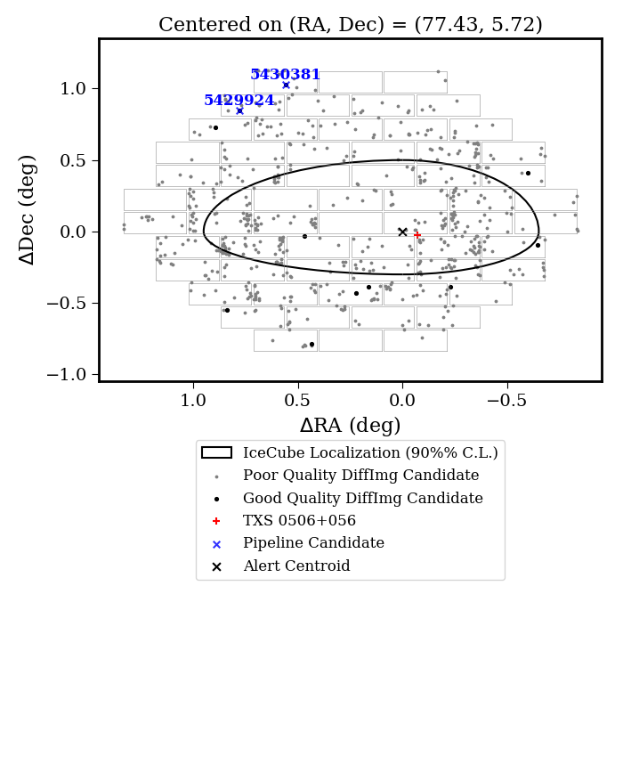
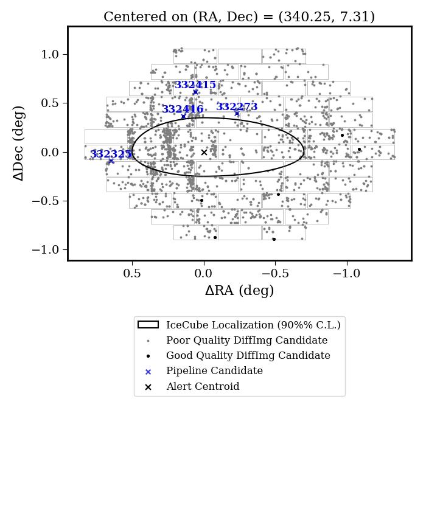
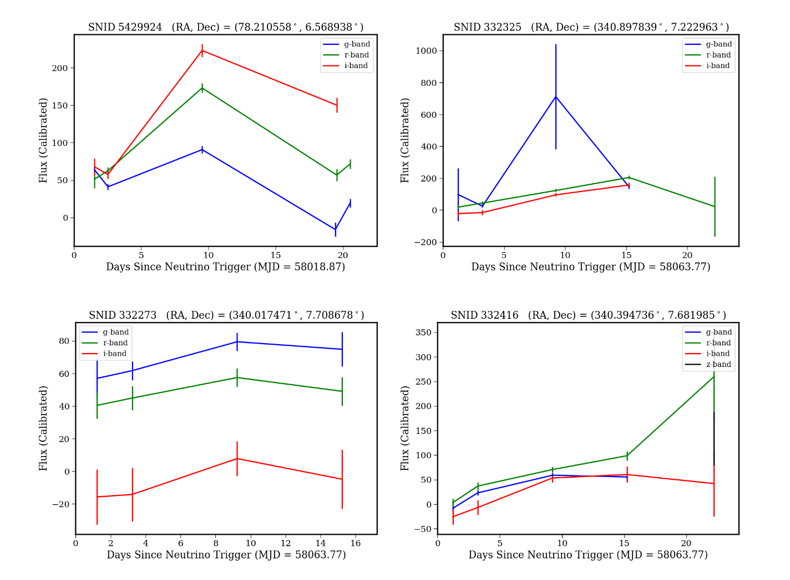

# February 13, 2019

## What's on Rob's Mind this Week...

### IceCube Follow-Up
Two issues remain before we can send the paper to collaboration-wide review:

1. Maximum likelihood analysis formalism is being revised to account for unrealistic probabilities.

2. Observed background is much higher than predicted by simulations. The most likely cause is contamination from non-supernovae transient sources.

Currently we are downloading the DECam images to determine if we can rule out any cnadidates using additional selection criteria.

### LIGO Follow-up
Currently fighting with software to simulate several classes of extragalactic transients with the observing conditions to match a rapid LIGO binary neutron star merger alert follow-up. 

The simulations will also genreate classes of transients in numbers porportional to the observed/predicted volumetric rates, allowing me to construct a realistic training set for a machine learning classifier.

### DES Photometric Type-Ia Supernova Cosmology

Currently members of the working group are developing a pipeline for the analysis. Once it is finished (~2 weeks), I will be able to start an analysis of how perturbation to hyperparameters in classification algorithms affect final cosmology parameters.

### LSST Commissioning

| Requirement | Status |
| --- | --- |
| OSS-REQ-0237 | Test case written and loaded into JIRA, ready for review |
| OSS-REQ-0340 | Found requirement with no needed test case and filled in Confluence page |
| OSS-REQ-0282 | _Calibration of the Instrumental Transmission_, just started work |

### LSST StackClub
Planning on jumping back in over the summer.