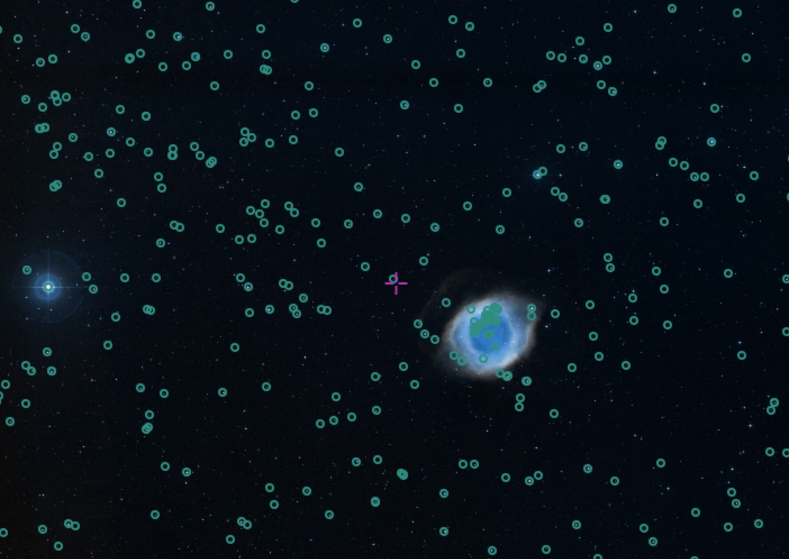
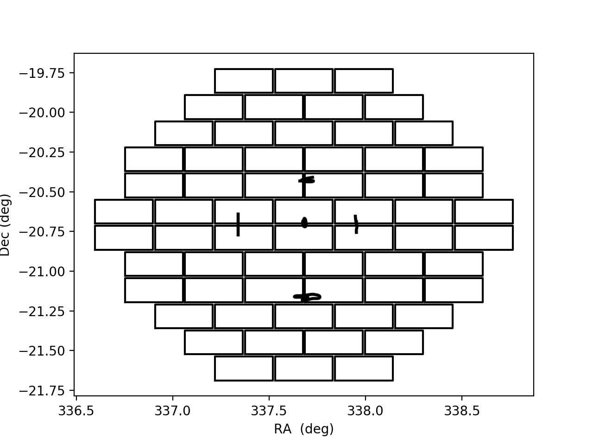
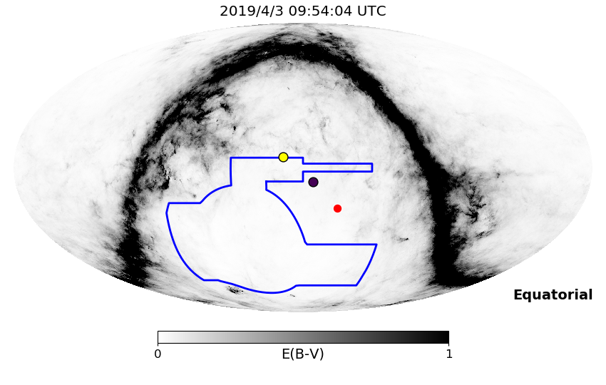

# April 3, 2019

## New IceCube Alert!

### Sky



### DECam Field of View compared to IceCube error region



### Location with respect to Sun, Moon, and DES footprint



```
Event
  Event ID = 15947448
  (ra, dec) = (337.6800, -20.7000)
Date
  Now = 2019/4/2 17:49:55 (UTC)
  Search time = 2019/4/2 17:49:53 (UTC)
  Optimal time = 2019/4/3 09:54:04 (UTC)
  Airmass at optimal time = 2.13
Sun
  Angular separation = 42.76 (deg)
  Next rising = 2019/4/3 10:54:50 (UTC)
  Next setting = 2019/4/2 22:39:00 (UTC)
Moon
  Illumination = 0.04
  Angular separation = 20.55 (deg)
  Next rising = 2019/4/3 09:14:19 (UTC)
  Next setting = 2019/4/2 21:33:19 (UTC)
  Next new moon = 2019/4/5 08:50:28 (UTC)
  Next full moon = 2019/4/19 11:12:09 (UTC)
Galactic
  (l, b) = (36.5471, -57.3149)
  E(B-V) = 0.01

```

### Observing conditions so far

Two nights ago

|expid  |ra |    dec |  ut | fil| time| secz | psf | sky | cloud | teff |
|---  |--- |    --- |  --- | ---| ---| --- | --- | --- | --- | --- |
|845402 |337.7 |-20.7 |09:48 | r | 150 |2.28 | 2.51 | 1.88 | 0.30 | 0.02| 
|845403 |337.7 |-20.6 |09:51 | r | 150 |2.24 | 2.47 | 2.15 | 0.33 | 0.02| 
|845404 |337.7 |-20.7 |09:54 | i | 150 |2.19 | 2.37 | 1.82 | 0.20 | 0.03|
|845405 |337.7 |-20.6 |09:57 | i | 150 |2.15 | 2.17 | 2.21 | 0.34 | 0.02| 
|845406 |337.7 |-20.7 |10:00 | z | 150 |2.10 | 1.79 | 1.47 | 0.26 | 0.05| 
|845407 |337.7 |-20.6 |10:03 | z | 150 |2.06 | 1.81 | 1.87 | 0.26 | 0.04| 

Last night

|expid  |ra |    dec |  ut | fil| time| secz | psf | sky | cloud | teff |
|---  |--- |    --- |  --- | ---| ---| --- | --- | --- | --- | --- |
|845689| 337.7 |-20.7 |09:45 | r | 150 |2.25 | 1.74 | 1.65 | 0.28 | 0.05 |
|845690| 337.7 |-20.6 |09:48 | r | 150 |2.21 | 1.42 | 1.89 | 0.32 | 0.06 |
|845691| 337.7 |-20.7 |09:51 | i | 150 |2.16 | 1.26 | 1.63 |-0.11 | 0.11 |
|845692| 337.7 |-20.6 |09:54 | i | 150 |2.12 | 1.22 | 2.04 | 0.03 | 0.08 |
|845693| 337.7 |-20.7 |09:57 | z | 150 |2.07 | 1.15 | 1.33 | 0.11 | 0.17 |
|845694| 337.7 |-20.6 |10:00 | z | 150 |2.04 | 1.10 | 1.73 | 0.13 | 0.13 |