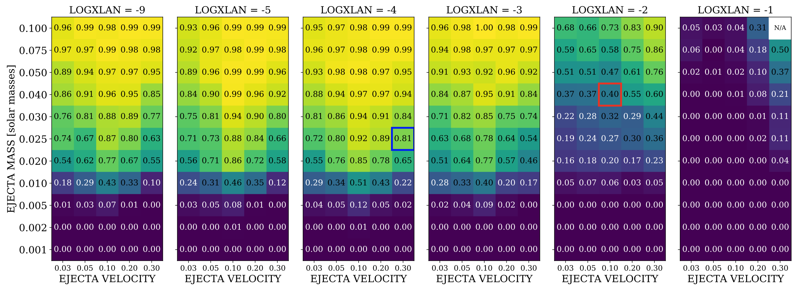
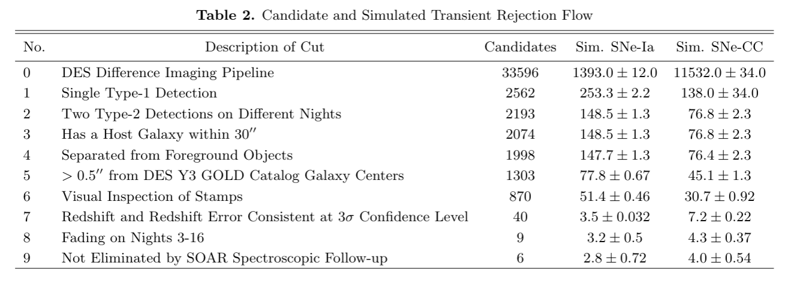
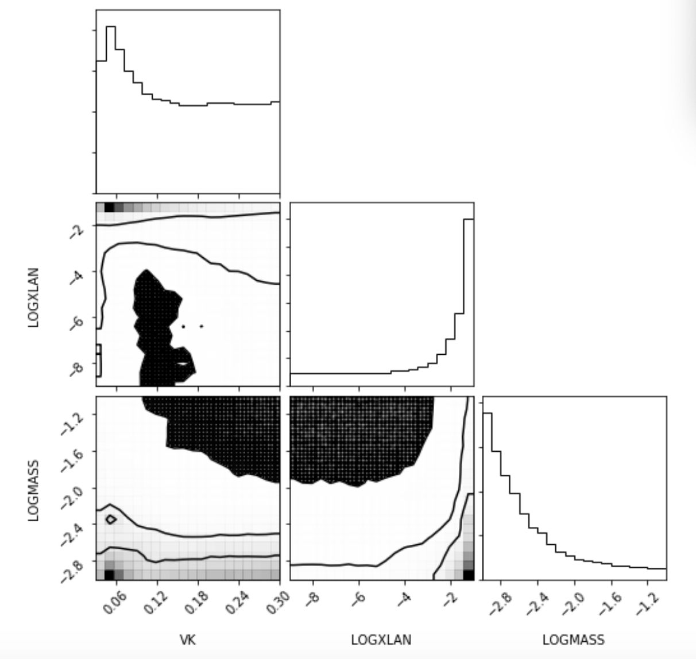
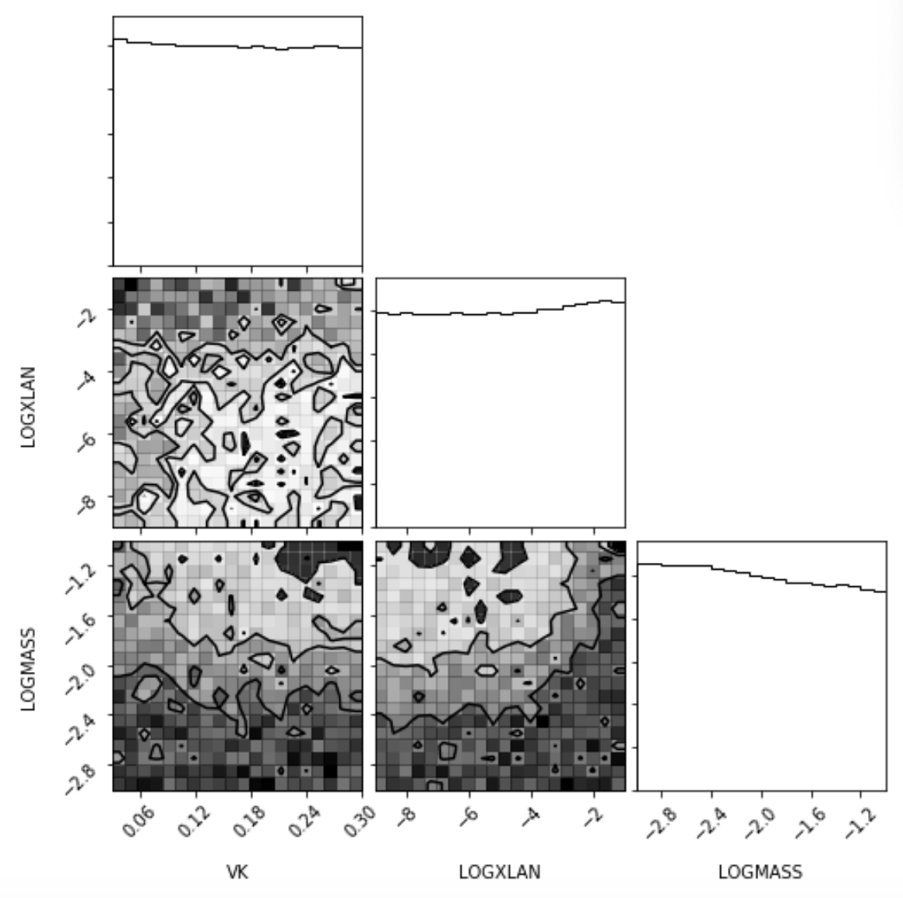

## January 9, 2020

# DESGW Updates

### Detection Efficiencies

 

### Remaining Backgrounds

### KN Parameter Estimation based on Non-Detection

Starting from Bayes's Law

$$ P(\textrm{ KN Properties } | \textrm{ Non Detection }) = \frac{P(\textrm{ Non Detection } | \textrm{ KN Properties }) \times P(\textrm{ KN Properties })}{P(\textrm{ Non Detection })} $$

and noting

$$ P(\textrm{ KN Properties }) \sim \textrm{Uniform} $$

$$ P(\textrm{ Non Detection }) = \sum_{i \in \textrm{KN Properties}} (1 - P_\textrm{Det}(i)) \sim \textrm{constant}$$ 

we can write $$ P(\textrm{ KN Properties } | \textrm{ Non Detection }) \propto P(\textrm{ Non Detection } | \textrm{ KN Properties }) $$

where $$ P(\textrm{ Non Detection } | \textrm{ KN Property i }) = 1 - \frac{P_\textrm{Det}(i)}{P_\textrm{Det}(i) + B} $$

And if you have a background remaining that was not supressed by selection criteria...

