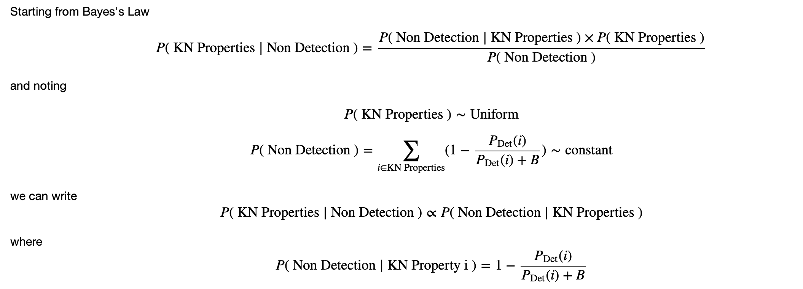

## January 9, 2020

# DESGW Updates

### Detection Efficiencies

  

### Remaining Backgrounds

### KN Parameter Estimation based on Non-Detection

And if you have a background remaining that was not supressed by selection criteria...

