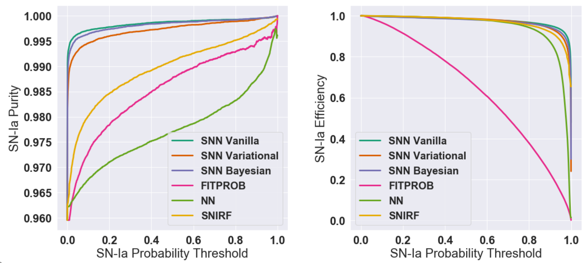

## June 26, 2019

# DES Photometric SNe Cosmology

Work done for collaboration meeting in comparing classifiers:

We decided more preliminary steps had to be taken to compare classifiers fairly.

**My sub-project:** Determine the cuts to place on the data to optimize cosmology results. These cuts will be applied to all training / testing sets for the classifiers in order to get accurate estimates of classification efficiency.

**Methodology:** Consider the effect of different cuts in the space of uncertainty on w and core-collapse contamination

Method of estimating core-collapse contamination for both real data and simulations:

