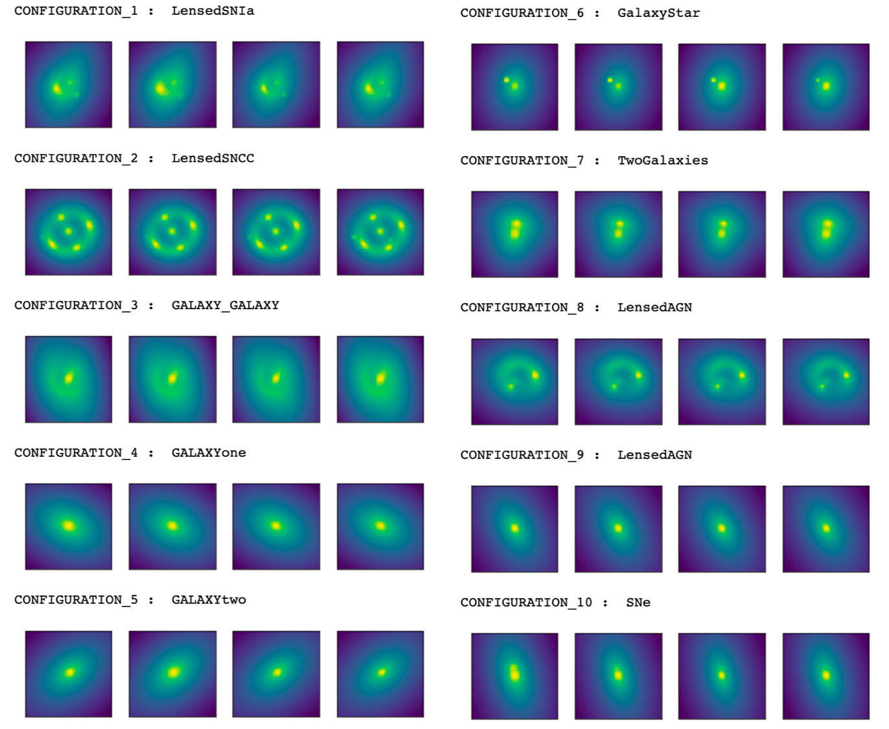
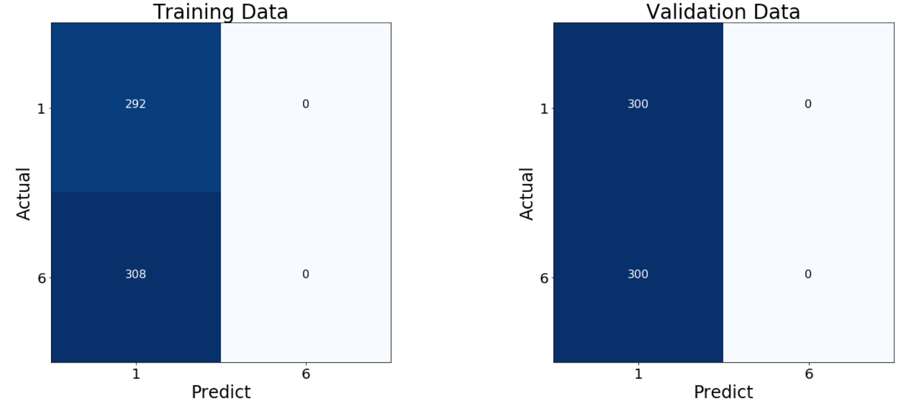

## March 5, 2019

# DeepLenstronomy

### An example of what DeepLenstronomy can do!

All images came from this command:
```
deeplenstronomy.deeplenstronomy.make_dataset(config_file)
```

The object `config_file` references a file that contains all information about the objects and orientations in the dataset, and `deeplenstronomy` uses that information to simulate an entire dataset of images and associated metadata.



### What I'm thinking about now

I'm trying to use these images to train a CNN to learn the differences between the different `CONFIGURATION`s.

It's going poorly.


