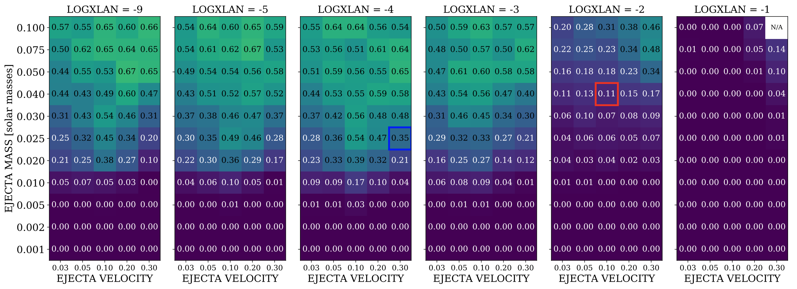
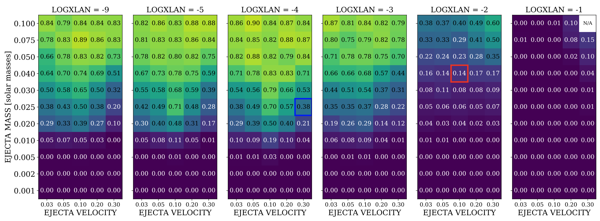

## March 19, 2020

# GW

### Realtime analysis of S200224ca (BBH at z~0.3)

- Finished!!!!!!

- 4 nights of observations of 72 sq deg of sky in the i-band. Found 8 potential counterparts out of ~72,000 difference imaging detections.

- Called "astronomical dibs" on all 8 objects by uploading to the Transient Name Server

- Authored 2 GCNs: [GCN 27227](https://gcn.gsfc.nasa.gov/gcn3/27227.gcn3) and [GCN 27366](https://gcn.gsfc.nasa.gov/gcn3/27366.gcn3)

### Papers

- Co-author on S190510g paper (Garcia et al. 2020) (now in Collaboration Wide Review)

- Responding to co-author comments on S190814bv paper (Morgan et al. 2020) (Almost ready for Internal Review)

**Main comment is to imporve the signal efficiency after cuts:**

Before: Average Efficiency = 37%

After: Average Efficiency = 40%

Done, just need to rerun everything and update figures and numbers in the paper draft.