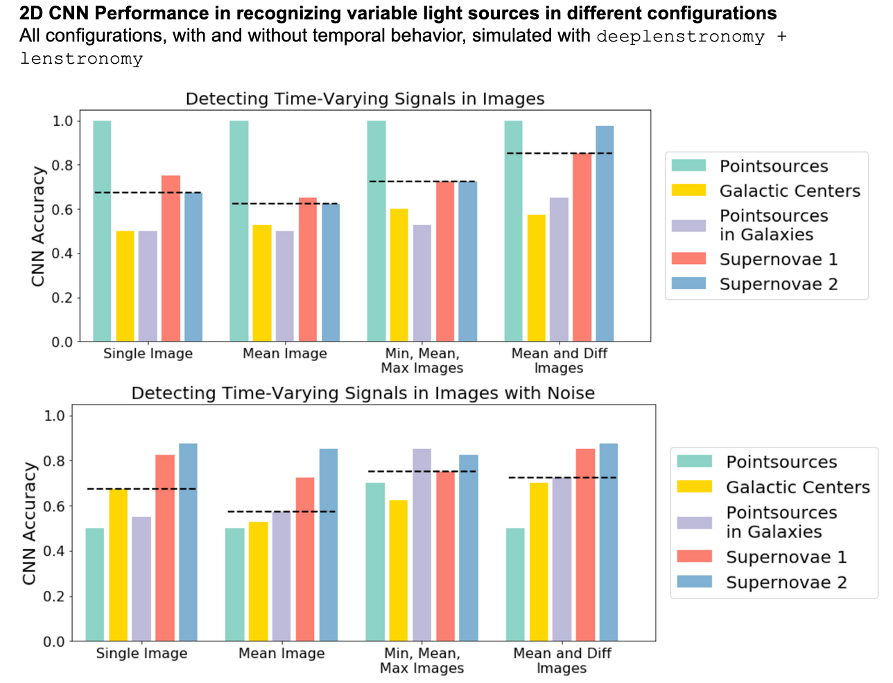

## March 26, 2020

# Strong Lensing

### Detecting Transient Light in Images

**2D CNN**

- For a set of images, use the mean, min, and max images as inputs
- For a set of images, use the mean and difference between the max and min images as inputs

**3D CNN**

- Build a 3D image with axes RA, DEC, Time (similar to video processing)

**Separate Classification**
 
Extract light curve from object in images using difference imaging and classify the light curve separately from the images

- RNN 
- Adaptation of `KN-Classify`
- Simple variability cuts