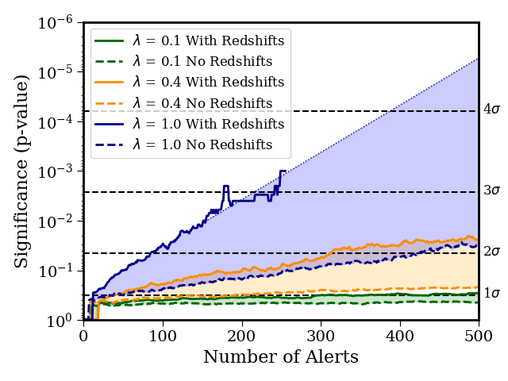

## March 27, 2019 Update

1. Currently at LSSTC DSFP learning about databases and software engineering
2. IceCube paper now in second round of internal review
3. KN-Classify is fully operational and accessible on DES machines at FermiLab for on-call observers to use during a LIGO alert

```
/data/des41.a/data/rmorgan/KN-Classify
```

### Major new / final results from IceCube analysis



Under the most optimum conditions, we estimate it will take O(200) alerts to determine whether CC SNe make up a significant fraction of the mostly unexplained high-energy neutrino flux at the 3 sigma confidence level.

It takes a lot of alerts because supernovae are common enough that we expect roughly one unassociated SNe that looks like it exploded right at the time of the neutrino to be in the DECam field of view during each follow-up, and we only expect to detect the neutrino-causing SNe about 5% of the time. So it takes a lot of alerts to observe a statistically significant excess of temporally coincident SNe.
