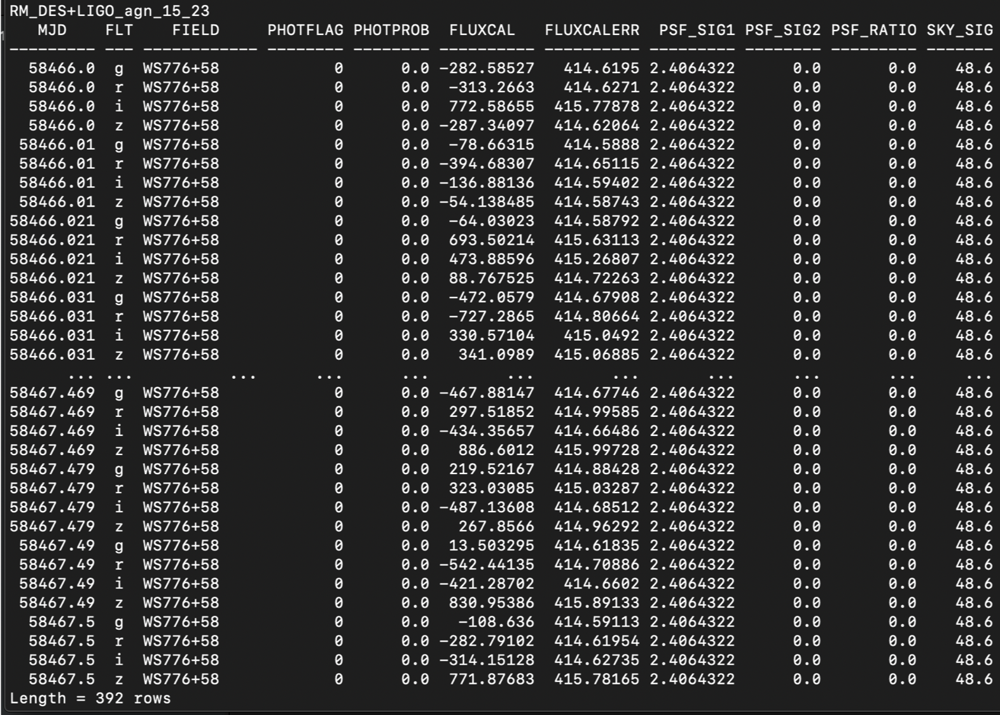

## May 22, 2019

# IceCube Follow-Up 

1. CWR for paper ends tomorrow
2. Two alerts to analyze (190331A and 190503A)

# LIGO Follow-Up

1. KN-Classify getting a major upgrade!
2. Solved problem of general cadence applicability with dense light curves

A Dense Light Curve:

Three Down-Sampled DLCs to match a desired cadence:

# SN-Ia Photometric Classifier Validation

Just got the pipeline to work for the first time today!

