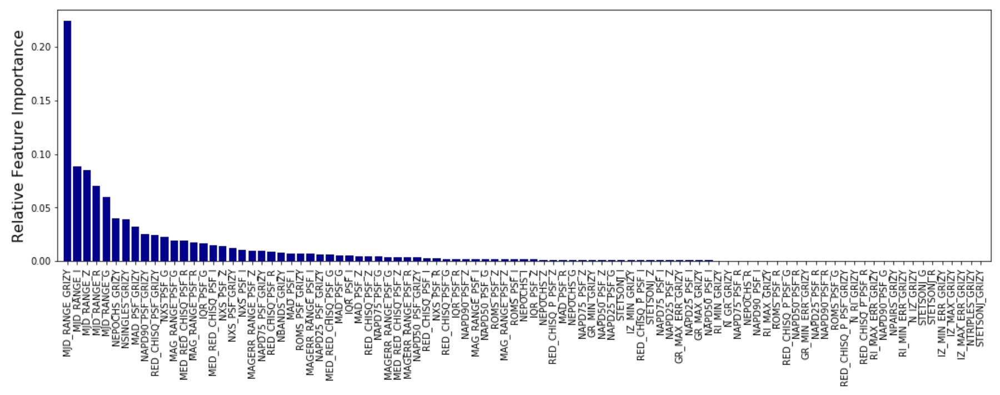
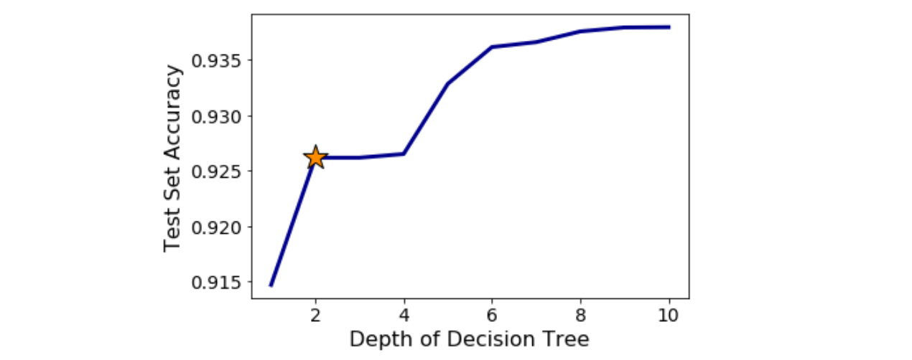
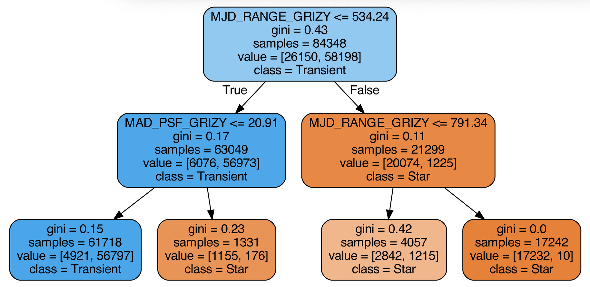
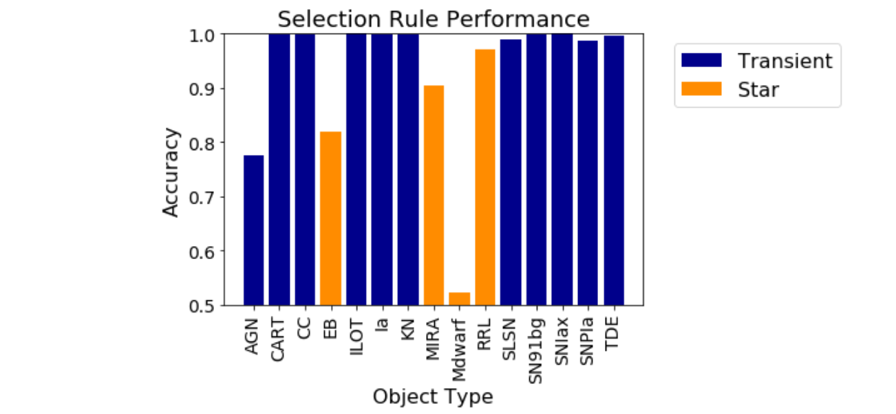
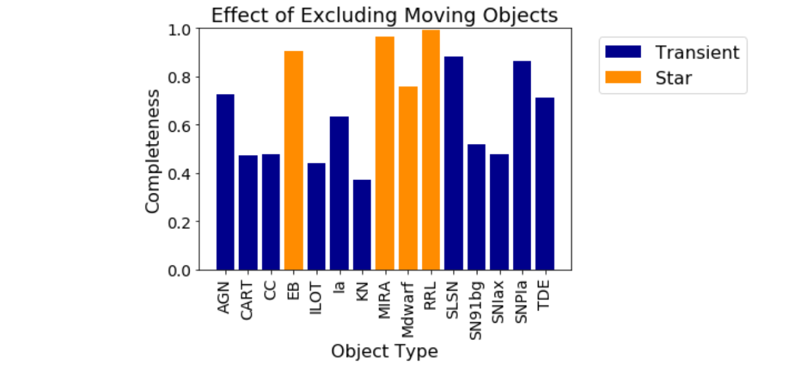

## May 28, 2020

# Searching for lensed transients

Find extragalactic transients (SNe, KNe, TDEs, etc.) near redMaGiC galaxies in DES wide-field survey images.

### What do transient light curves look like in wide-field data?

- Collect exposure numbers that contain a redMaGiC galaxy
- Query database for observing conditions of those exposures
- Construct a cadence based on overlapping exposures

```
# --------------------------------------------
LIBID: 1
RA: 79.921587    DECL: -22.645730   NOBS: 19
MWEBV: 0.000   PIXSIZE: 0.270
FIELD: 789-237  # CCDS: [ 6 24]
TEMPLATE_ZPT: 31.259 31.551 31.520 31.296 30.210
TEMPLATE_SKYSIG:   18.51   27.46   47.41   94.07   71.37
#                           CCD  CCD           PSF1 PSF2 PSF2/1
#     MJD      IDEXPT  FLT GAIN NOISE  SKYSIG  (pixels)  RATIO ZPTAVG ZPTSIG    MAG
S: 57781.190     613767 g  1.06  0.00   18.51  1.72 0.00 0.000  31.26  0.003  99.000
S: 57781.165     613749 i  1.03  0.00   47.41  0.97 0.00 0.000  31.52  0.002  99.000
S: 57781.166     613750 r  1.06  0.00   27.46  1.01 0.00 0.000  31.55  0.003  99.000
S: 57791.174     617701 z  1.02  0.00   94.07  0.70 0.00 0.000  31.30  0.003  99.000
S: 57792.167     618198 Y  1.02  0.00   71.37  0.86 0.00 0.000  30.21  0.004  99.000
S: 58170.077     723646 g  1.03  0.00   24.66  1.01 0.00 0.000  31.35  0.003  99.000
S: 58170.078     723647 z  0.98  0.00   72.01  0.79 0.00 0.000  31.28  0.003  99.000
S: 58492.186     810084 g  1.07  0.00   18.20  0.82 0.00 0.000  31.58  0.003  99.000
S: 56982.346     380101 i  0.97  0.00   56.30  0.94 0.00 0.000  31.68  0.002  99.000
S: 57004.285     387183 z  1.00  0.00   85.79  0.98 0.00 0.000  31.27  0.003  99.000
S: 57025.222     393920 Y  1.01  0.00   58.13  0.80 0.00 0.000  29.54  0.004  99.000
S: 57365.321     500571 g  0.96  0.00   22.04  0.86 0.00 0.000  30.96  0.003  99.000
S: 57365.320     500570 r  0.99  0.00   30.64  0.76 0.00 0.000  31.46  0.003  99.000
FIELD: 806-227  # CCDS: [48]
TEMPLATE_ZPT: 31.427 30.734 31.592 31.343 29.555
TEMPLATE_SKYSIG:   21.58   46.52   63.09   88.29   60.56
S: 56997.330     384267 Y  0.98  0.00   60.56  0.75 0.00 0.000  29.56  0.004  99.000
S: 57004.286     387184 i  1.01  0.00   63.09  1.01 0.00 0.000  31.59  0.003  99.000
S: 57049.198     403483 g  0.98  0.00   21.58  0.91 0.00 0.000  31.43  0.003  99.000
S: 57053.119     404805 z  0.99  0.00   88.29  0.76 0.00 0.000  31.34  0.003  99.000
S: 57360.251     499145 r  0.99  0.00   46.52  0.85 0.00 0.000  30.73  0.003  99.000
S: 57361.246     499484 r  0.99  0.00   30.44  0.91 0.00 0.000  31.64  0.003  99.000
END_LIBID: 1
# --------------------------------------------
```

- Simulate _grizY_ photometry using real cadences for several objects:
	- Active Galactic Nuclei, Calcium-Rich Transients, Intermediate-Luminosity Optical Transients, Kilonovae, Tidal Disruption Events
	- Supernovae- Ia, Ib, Ic, Ibc, II, IIN, IIL, IIP
	- More SNe: Superluminous SNe, SN91bg-like SNe, Point-Instability SNe, Peculiar SNe-Ia (Iax)
	- Mira Variables, Mdwarf Stellar Flares, RR-Lyrae, Eclipsing Binaries

### Determining the best metrics for finding transients

- Calculate variablity metrics from the DES Y6 Quick Catalog
- Have a machine learn how to distinguish transients from variable stars



- Simplify the classification scheme to a decision tree



- The optimal decision tree looks like this:



### Assessing Selection Rule Performance

How well does the selection work on each object class?



How will these transients be affected by cutting out moving objects?



### Next Steps

- Retrain a decision tree using physically-motivated class representation
- Select objects in Y6 Quick Catalog for which 2+ objects are detected near a redMaGiC galaxy
- Apply selection rules to objects to get candidate lensed transients