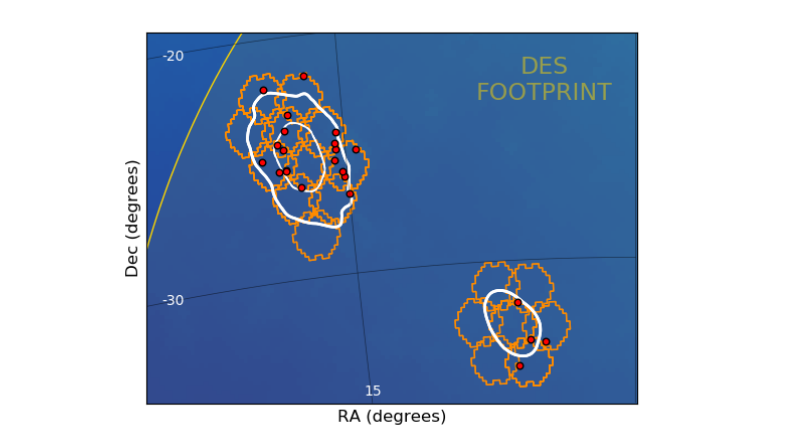
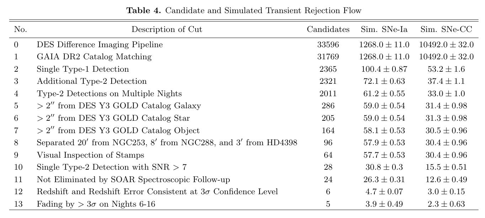
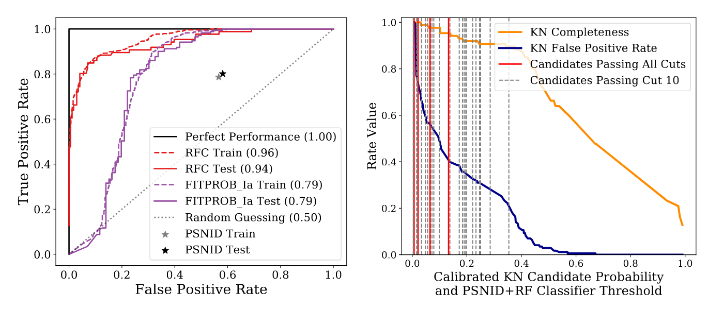
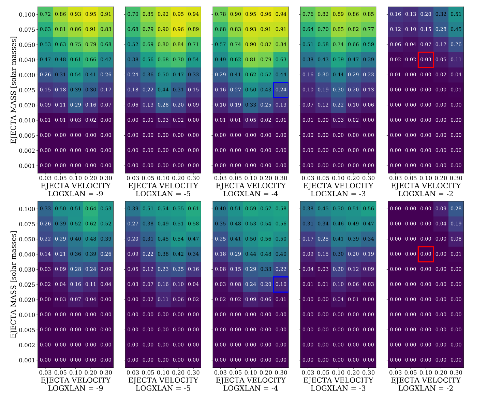

## October 10, 2019

# GW Follow-Up

Making progress on a paper for the NSBH follow-up

### Observations
LIGO + VIRGO Trigger: August 14

DECam Observations: Nights 1, 2, 4, 5, 6, 16 after trigger

### Cut Flow

### Photometric Classification of Remaining Candidates

### Mean light curves of remaining candidiates

### Analyzing Kilonova Detection Efficiency

