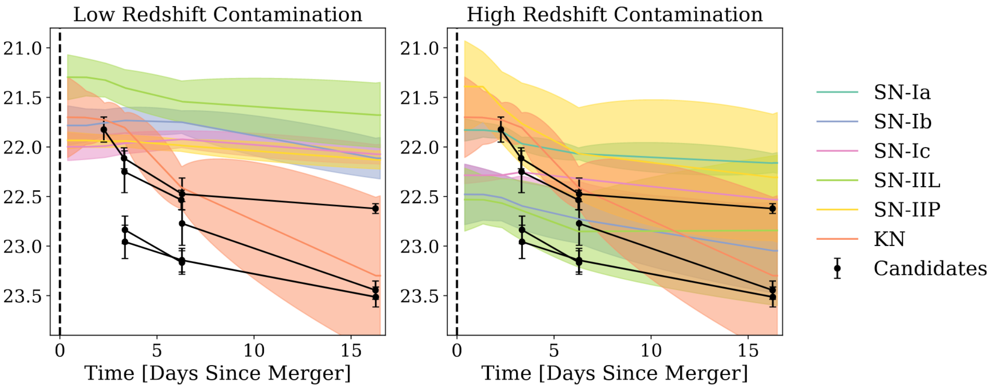

## October 17, 2019

# GW Follow-Up

Plot from last time that didn't work.



# SN Cosmology

Initial cuts on traning samples have been finalized and accepted by SNWG.

```
Original
------------------------------------------------
SALT2 Fit                             3890
  - cutwin_cid  = 1, 99999900
  - CUTWIN_MJD   = 56500, 58200
  - CUTWIN_REDSHIFT = 0.001 3
  - CUTWIN_REDSHIFT_ERR = 0.0, 0.01
  - CUTWIN_SNRMAX       = 4, 99999
  - cutwin_Trest     = -20.0,   60.0
  - cutwin_Trestmin  = -20.0,   0.0

Baseline
------------------------------------------------
FITPROB      (0.001, 2.0)             3322
SNRMAX1      (4.0, 1000.0)            3322
SNRMAX2      (-200.0, 1000.0)         3322
SNRMAX3      (-200.0, 1000.0)         3322
c            (-1.7, 1.7)              3322
cERR         (0, 2.6)                 3322
x1           (-4.0, 4.0)              3322
x1ERR        (0.0, 3.0)               3322
mB           (9.0, 32.0)              3322
mBERR        (0.0, 1.0)               3322
PKMJDERR     (0.0, 6.0)               3322
zHD          (0.001, 1.3)             3299
zHDERR       (-1.0, 0.011)            3299

Cuts Found from wfit Iteration
------------------------------------------------
mB           (19.0, 25.5)             3276
mBERR        (0.0, 0.24)              3184
x1           (-3.2, 3.2)              3005
PKMJDERR     (0.0, 2.3)               2839

Cuts Found from Distributions
------------------------------------------------
c            (-0.8, 1.01)             2837
cERR         (0.0, 0.7)               2832
x1ERR        (0.0, 2.5)               2827
SNRMAX2      (3.0, 1000.0)            2793
```

Next step is to determine how tightening of the cuts further can be used in increase classification accuracy.
