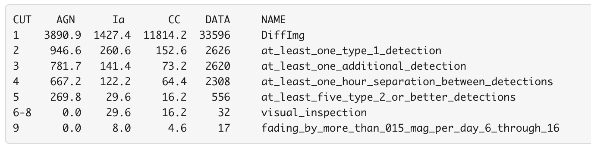
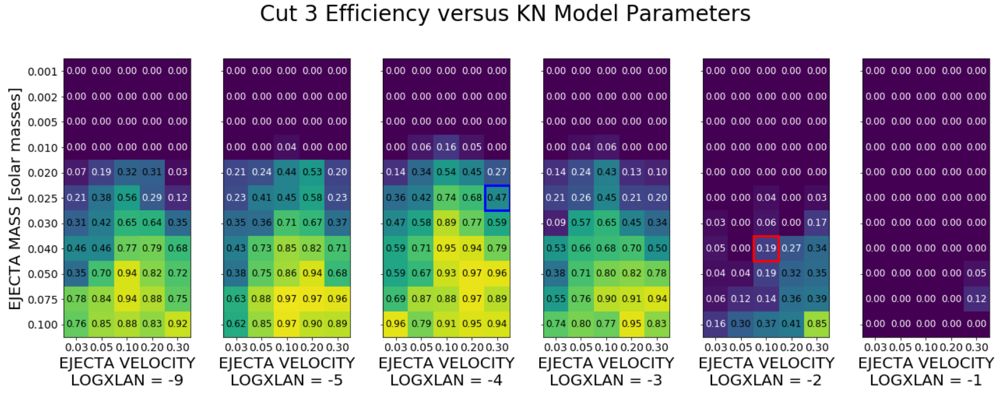
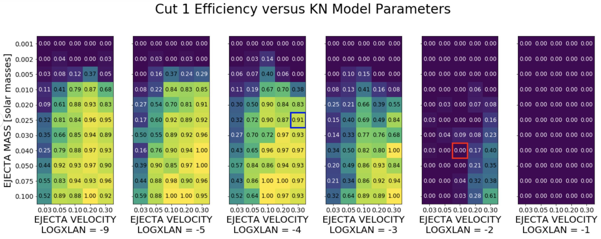

## September 18, 2019

# GW Follow-Up

Pipeline for simultaneously analyzing simulations and data.

### Cut Flow

Example from cuts applied to GW190814

### Analyzing Kilonova Detection Efficiency

**GW190814**

**GW190510**

