# Candidates from IceCube Follow-up

## SNID 5430381

### Stamps

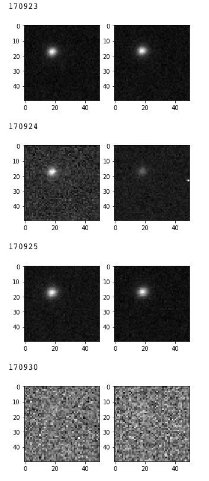
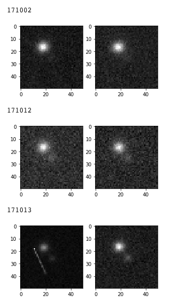

### Light Curves

### Catalog Searches

|  | SEP (arcsec)| CATALOG       |                          IDENTIFIER|
|---|---|---|---|
|0 |     2.171991 | VIZIER |                Subcatalog: II/328/allwise|
|1 |     2.248343 | VIZIER |                   Subcatalog: II/311/wise|
|2 |     2.580524 | VIZIER |                     Subcatalog: I/305/out|
|3 |     2.583199 |   CONE |             hstID: b'N9M3002683' class: 3|
|4 |     2.593825 | VIZIER | Subcatalog: II/349/ps1 116090779879557948|
|5 |     3.002774 | VIZIER |                     Subcatalog: I/284/out|
|6 |     3.004452 | VIZIER |                     Subcatalog: I/297/out|
|7 |     3.110157 | VIZIER |                  Subcatalog: I/317/sample|
|8 |     3.110157 | VIZIER |                   Subcatalog: I/324/igsl3|

### Classification

Likely a CC SNe

## SNID 5429924

### Stamps

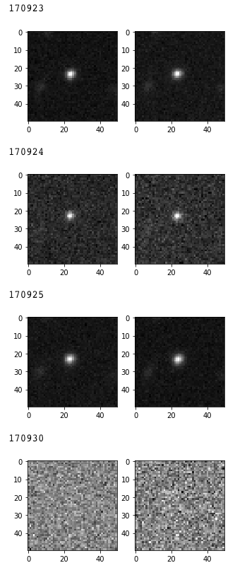
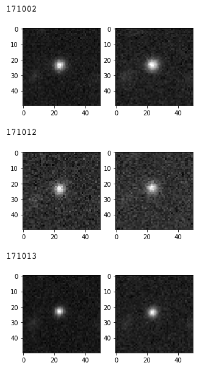

### Light Curves

### Catalog Searches

|  | SEP (arcsec) |CATALOG |                                   IDENTIFIER|
|---|---|---|---|
|0 |     0.350002 | VIZIER |                        Subcatalog: I/284/out|
|1 |     0.350934 | VIZIER |                        Subcatalog: I/297/out|
|2 |     0.398229 |   GAIA  |designation: b'Gaia DR2 3240852235592302464'|
|3 |     0.419449 | VIZIER   |  Subcatalog: II/349/ps1 115880782104693255|
|4 |     0.609356 |   CONE   |              hstID: b'N9M0010552' class: 3|
|5 |     0.609483 | VIZIER   |                    Subcatalog: I/324/igsl3|
|6 |     0.613628 | VIZIER   |                      Subcatalog: I/305/out|

### Classification

Likely AGN

## SNID 332273

### Stamps

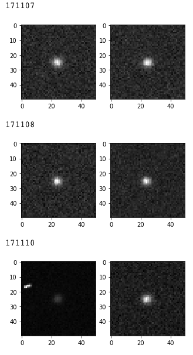
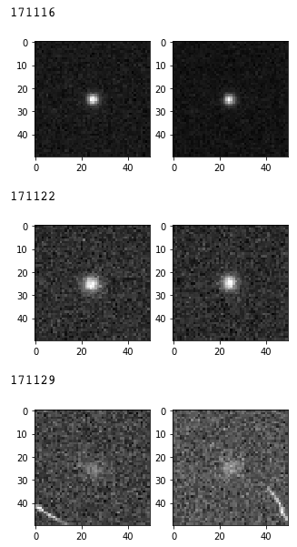

### Light Curves

### Catalog Searches

|   | SEP (arcsec) |CATALOG  |                               IDENTIFIER|
|---|---|---|---|
|0  |     0.153958 | VIZIER | Subcatalog: II/349/ps1 117253400175640932|
|1  |     0.169827 | VIZIER |                   Subcatalog: II/311/wise|
|2  |     0.246759 | VIZIER |     Subcatalog: J/MNRAS/450/3893/dame_qso|
|3  |     0.248157 |   SDSS |                objid: 1237669763872719487|
|4  |     0.259710 | VIZIER |                Subcatalog: II/328/allwise|
|5  |     0.259857 |   SDSS |                objid: 1237678800473424332|
|6  |     0.260056 | VIZIER |          Subcatalog: J/ApJS/234/23/c75cat|
|7  |     0.261981 | VIZIER |                   Subcatalog: II/314/las8|
|8  |     0.261981 | VIZIER |                   Subcatalog: II/319/las9|
|9  |     0.293583 | VIZIER |               Subcatalog: VII/280/catalog|
|10 |     0.293583 | VIZIER |            Subcatalog: J/ApJS/219/39/cand|
|11 |     0.340442 | VIZIER |                     Subcatalog: I/267/out|
|12 |     0.539106 | VIZIER |                     Subcatalog: I/305/out|
|13 |     0.561669 |   CONE |             hstID: b'N0OV018144' class: 0|
|14 |     1.254446 | VIZIER |              Subcatalog: II/335/galex_ais|
|15 |     4.631308 | VIZIER |              Subcatalog: II/335/galex_ais|

### Classification

Likely a QSO or AGN

## SNID 332325

### Stamps

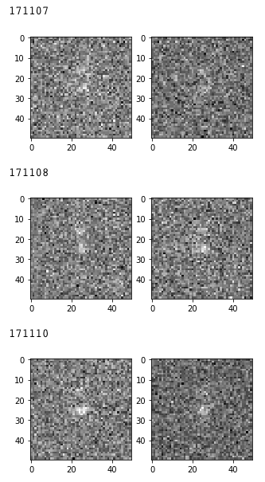
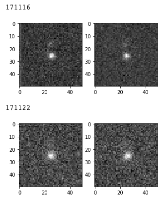

### Light Curves

### Catalog Searches

|   |SEP (arcsec) |CATALOG |                                IDENTIFIER|
|---|---|---|---|
|0  |    2.142618 |   SDSS |                objid: 1237669698375189682|
|1  |    2.209588  |VIZIER | Subcatalog: II/349/ps1 116663408970868280|
|2  |    2.344584  |VIZIER |                   Subcatalog: II/314/las8|
|3  |    2.344584  |VIZIER |                   Subcatalog: II/319/las9|

### Classification

Likely CC SNe

## SNID 332415

### Stamps

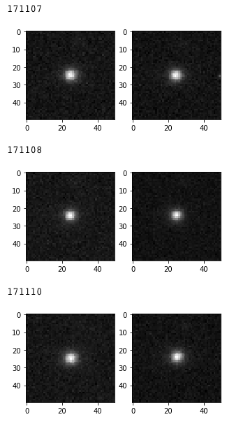
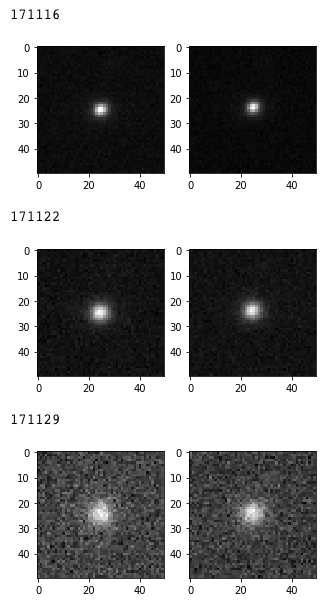

### Light Curves

### Catalog Searches

|   | SEP (arcsec) |CATALOG  | IDENTIFIER |
|---|---|---|---|
|0  |     0.094839 |   SDSS  | objid: 1237678905163383357 |
|1  |     0.149825 |   CONE  | hstID: b'N0OV004928' class: 3 |
|2  |     0.681648 | VIZIER  | Subcatalog: J/ApJ/737/45/table1 |
|3  |     0.681648 | VIZIER  | Subcatalog: VIII/92/first14 |
|4  |     0.681648 | VIZIER  | Subcatalog: VIII/65/nvss |
|5  |     0.681648 | VIZIER  | Subcatalog: V/148/morx |
|6  |     0.681648 | VIZIER  | Subcatalog: II/349/ps1 117513403076964828  |
|7  |     0.681648 | VIZIER  | Subcatalog: II/328/allwise |
|8   |    0.681648 | VIZIER  |  Subcatalog: II/319/las9 |
|9  |     0.681648 |   SDSS  | objid: 1237669699448669045   |
|10 |     0.681648 | VIZIER  | Subcatalog: II/311/wise |
|11 |     0.681648 | VIZIER  | Subcatalog: I/324/igsl3  |
|12 |     0.681648 | VIZIER  | Subcatalog: I/305/out  |
|13 |     0.681648 | VIZIER  | Subcatalog: I/297/out   |
|14 |     0.681648 | VIZIER  |  Subcatalog: I/284/out   |
|15 |     0.681648 |    NED  | Object Name: b'PQV1 J224113.86+075543.3' Type: b'VisS' |
|16 |     0.681648 | VIZIER  | Subcatalog: J/ApJ/862/12/scussphz  |
|17 |     0.681648 | VIZIER  | Subcatalog: II/314/las8  |

### Classification

Likely AGN

## SNID 332416

### Stamps

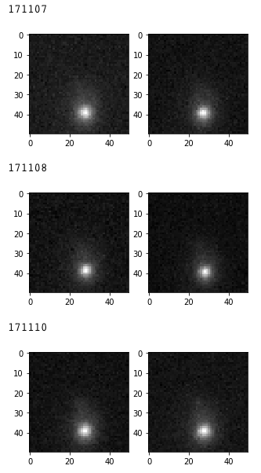
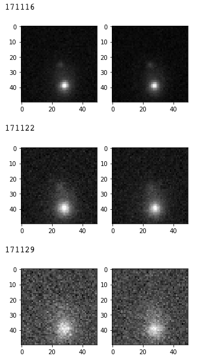

### Light Curves

### Catalog Searches

|   | SEP (arcsec) |CATALOG |                                           IDENTIFIER|
|---|---|---|---|
|0  |     1.622661 | VIZIER |                              Subcatalog: II/319/las9|
|1  |     1.622661 | VIZIER |                              Subcatalog: II/314/las8|
|2  |     3.144062 | VIZIER |                                Subcatalog: I/267/out|
|3  |     3.322845 | VIZIER |                         Subcatalog: II/335/galex_ais|
|4  |     3.625170 | VIZIER |                                Subcatalog: I/297/out|
|5  |     3.625901 | VIZIER |                                Subcatalog: I/284/out|
|6  |     3.687219 | VIZIER |                                Subcatalog: I/252/out|
|7  |     3.709323 | VIZIER |                                Subcatalog: I/305/out|
|8  |     3.739468 |   CONE |                        hstID: b'N0OV003204' class: 3|
|9  |     3.766771 | VIZIER |                              Subcatalog: II/311/wise|
|10 |     3.848577 | VIZIER |                            Subcatalog: II/313/table3|
|11 |     3.859134 | VIZIER |                           Subcatalog: II/328/allwise|
|12 |     3.859796 | VIZIER |                              Subcatalog: II/319/las9|
|13 |     3.859796 | VIZIER |                              Subcatalog: II/314/las8|
|14 |     3.870376 | VIZIER |                              Subcatalog: I/324/igsl3|
|15 |     3.892498 | VIZIER |            Subcatalog: II/349/ps1 117213403957738581|
|16 |     3.946042 |   SDSS |                           objid: 1237669763872850824|
|17 |     3.946046 |   SDSS |                           objid: 1237669763872850825|
|18 |     3.954813 |   SDSS |                           objid: 1237678800473555587|
|19 |     3.956821 | VIZIER |                    Subcatalog: J/ApJ/862/12/scussphz|
|20 |     4.011909 | VIZIER |                             Subcatalog: I/317/sample|
|21 |     4.232378 | VIZIER |                                Subcatalog: I/319/xpm|
|22 |     4.257271 |    NED | Object Name: b'2MASS J22413499+0740538' Type: b'IrS'|
|23 |     4.260576 | VIZIER |                               Subcatalog: II/246/out|

### Classification

Likely CC SNe