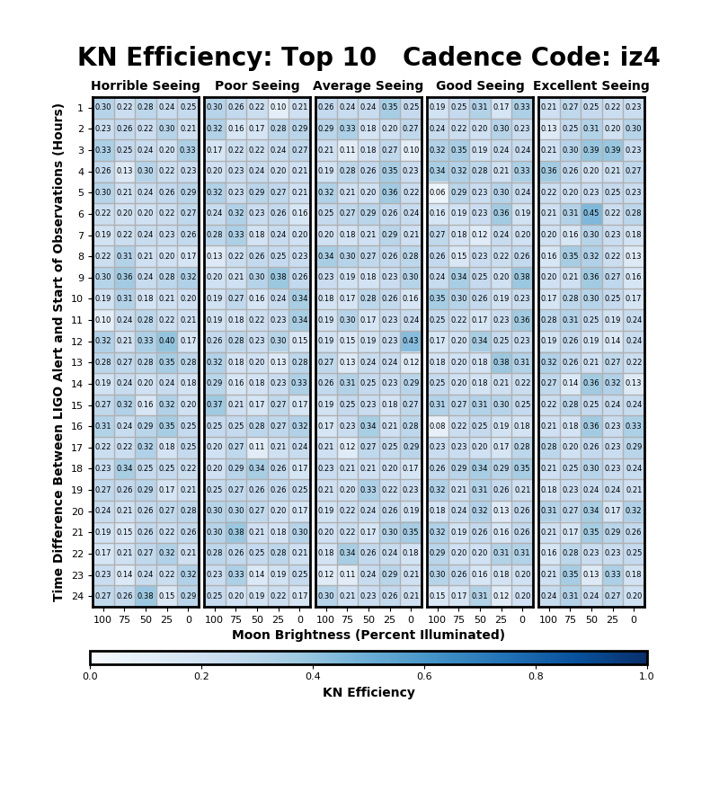
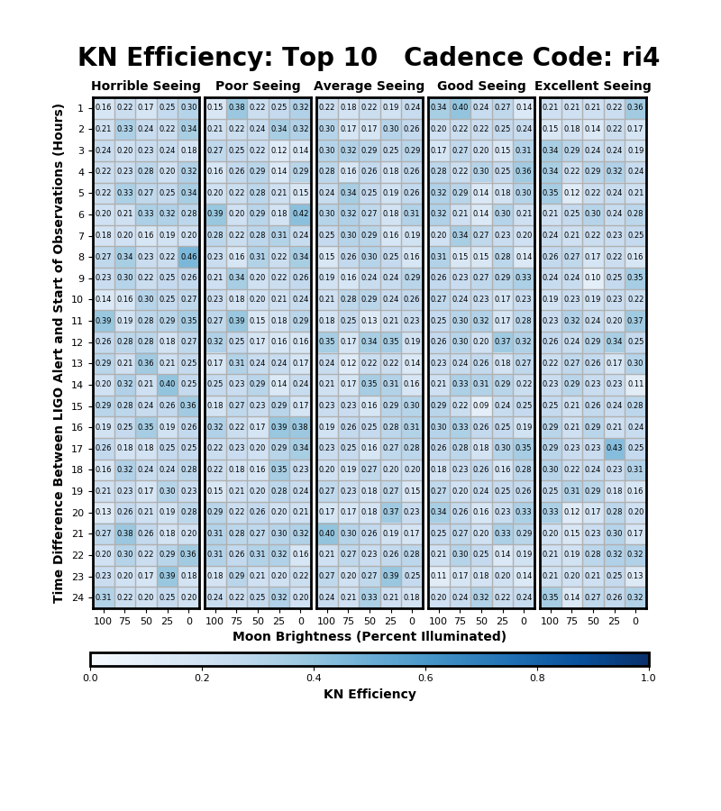
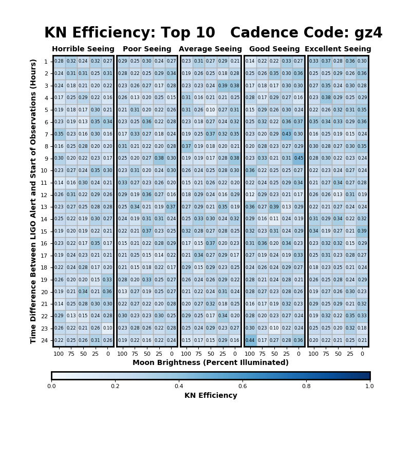

## March 6, 2019

# Preliminary Validation Results for KN-Classify

Note: The efficiency values are calculated with very difficult test sets and are likely an extreme underestimate. What I find most interesting is the similar performance across similar conditions.

Current concern: Including seeing and moon conditions makes it difficult to find real data that looks like the observations, so currently I can only train on simulations. Ideas so far:

- Use real data that might not match moon and seeing conditions anyways
- Augment real data to try to fake moon and seeing effects
- Any other ideas?

