## March 13, 2019

# IceCube Follow-Up Maximum Likelihood Analysis

## Summary

$f$ = Probability of the CC SNe causing an IceCube neutrino being detected

$\lambda$ = Fraction of IceCube neutrinos from CC SNe

The log likelihood for CC SNe contributing to the IceCube neutrino flux is
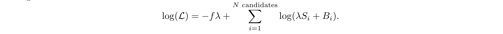
The log likelihood is maximized when the following condition is satisfied, which allows us to derive a proabbility of association for each candidate:
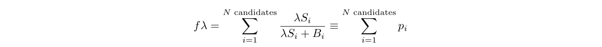

**Problem:** Under some conditions, these probabilities summed to a number larger than 1. Need to figure out what conditions cause this behavior and how it affects our results.

### Without Redshift Information

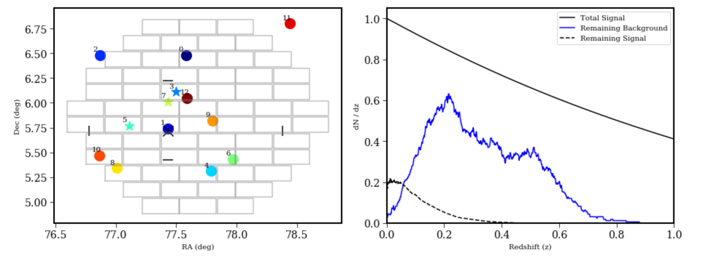
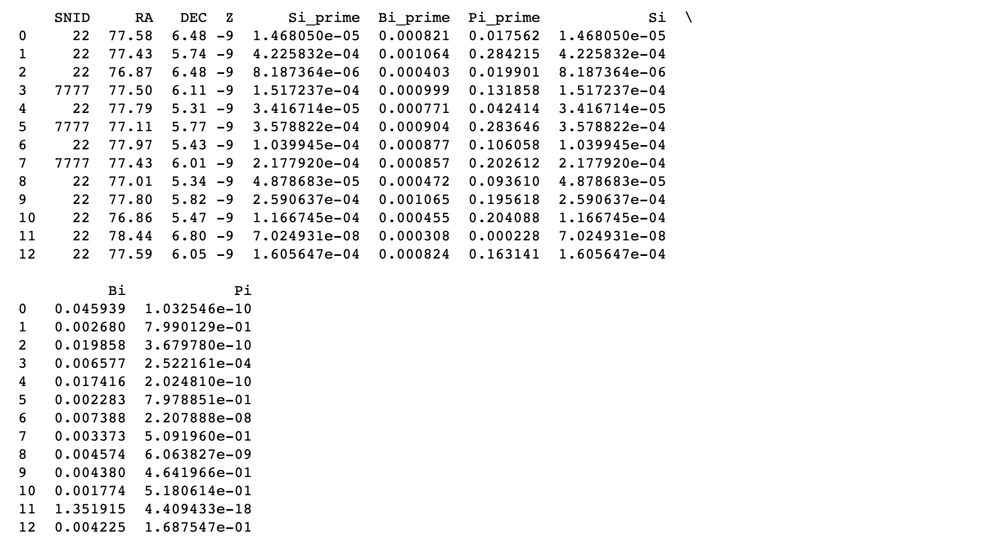
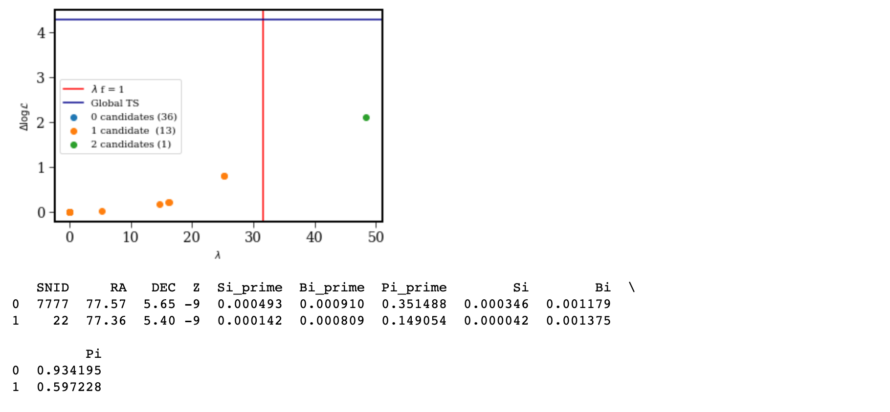

### With Redshift Information

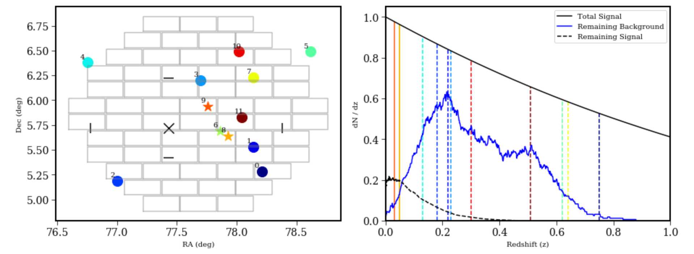
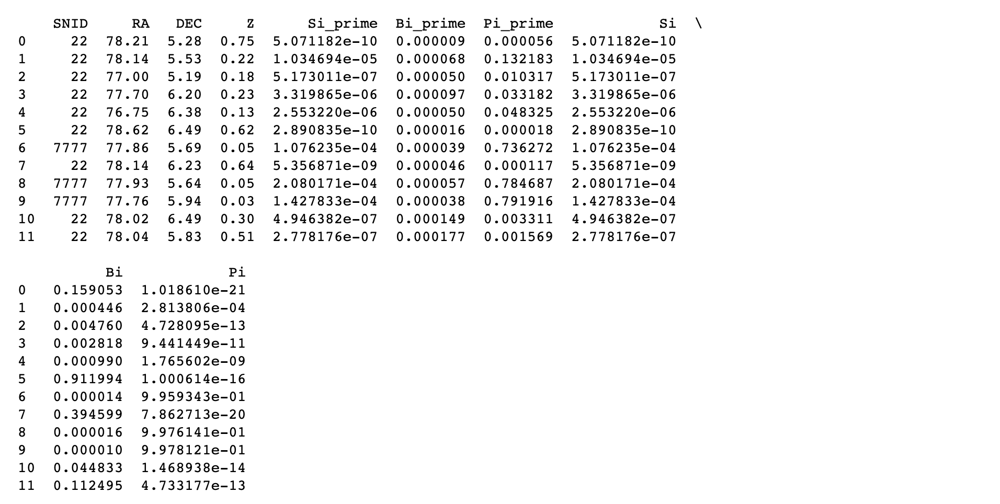
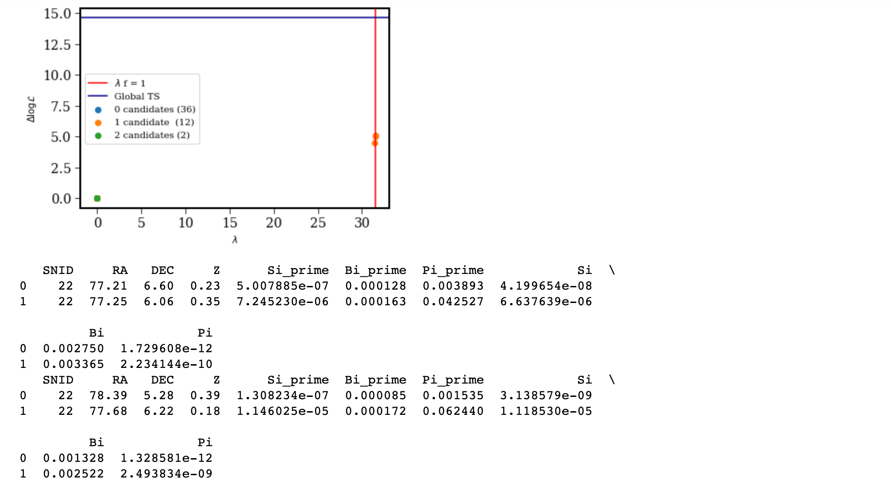

### Multiple (100) Realizations

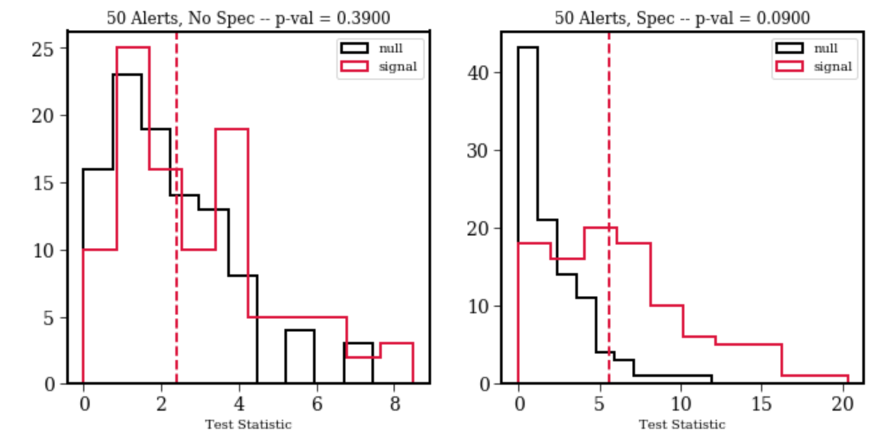

## Conclusion
$\lambda f$ is only larger than 1 in the case where we have no redshift information and detect 2 or more candidates, which is unlikely but ocurrs when multiple realizations are analyzed. 

# KN Efficiency Plot

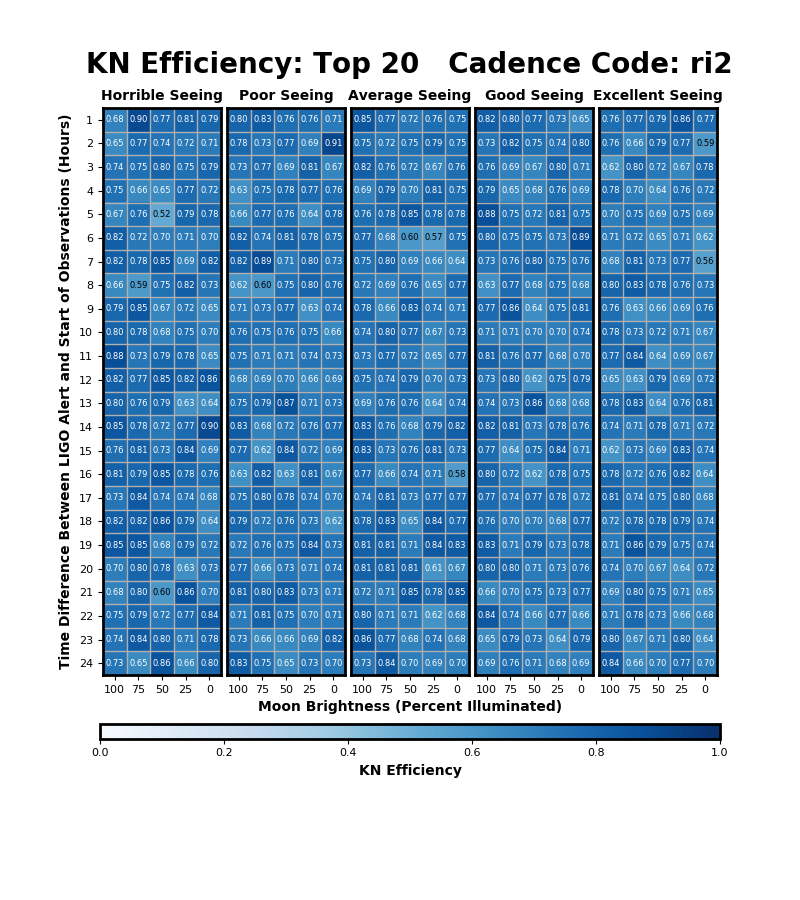
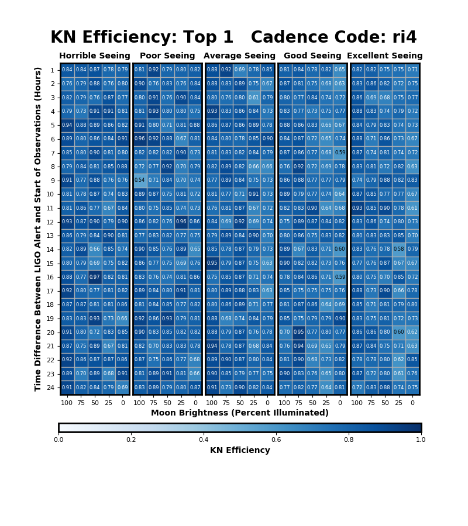
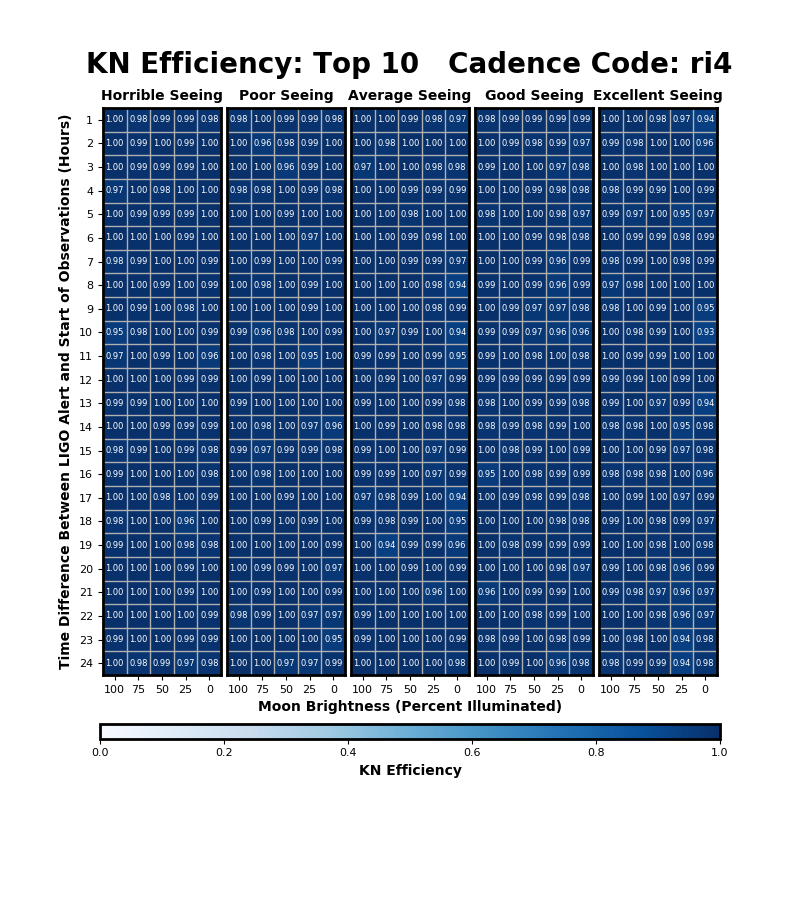